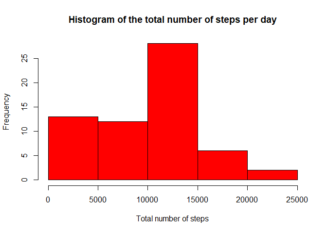
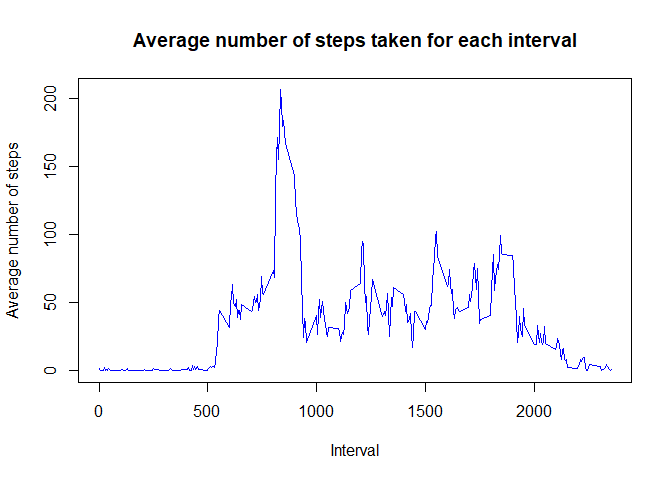
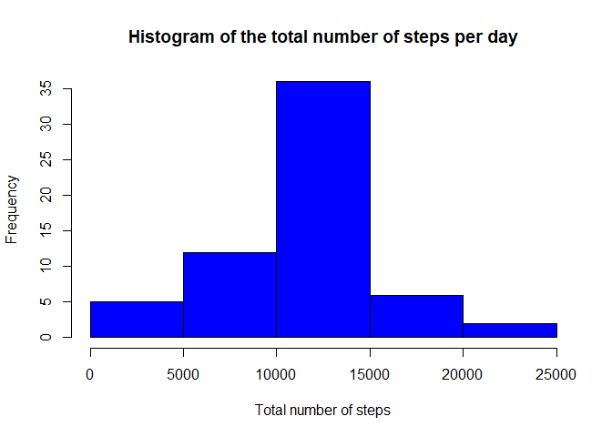

## Loading and preprocessing the data

```r
unzip(zipfile = "activity.zip")
activity<-data.table::fread("activity.csv" )
head(activity)
```

```
##    steps       date interval
## 1:    NA 2012-10-01        0
## 2:    NA 2012-10-01        5
## 3:    NA 2012-10-01       10
## 4:    NA 2012-10-01       15
## 5:    NA 2012-10-01       20
## 6:    NA 2012-10-01       25
```
## What is mean total number of steps taken per day?

Calculating the total number of steps taken each day 

```r
totalSteps<-activity[,TotalPerDay:=lapply(.SD,sum,na.rm=TRUE), .SDcols=c("steps"), by=date]
totalSteps<-subset(totalSteps,interval=="0") 
head(totalSteps)
```

```
##    steps       date interval TotalPerDay
## 1:    NA 2012-10-01        0           0
## 2:     0 2012-10-02        0         126
## 3:     0 2012-10-03        0       11352
## 4:    47 2012-10-04        0       12116
## 5:     0 2012-10-05        0       13294
## 6:     0 2012-10-06        0       15420
```

Making a histogram of the total number of steps taken each day

```r
hist(totalSteps$TotalPerDay,main = "Histogram of the total number of steps per day",xlab = "Total number of steps",col = "red")
```

<!-- -->

Calculating the mean and median of the total number of steps per day

```r
mean1<-mean(totalSteps$TotalPerDay,na.rm = TRUE)
median1<-median(totalSteps$TotalPerDay,na.rm = TRUE)
```

```
## [1] "Mean : "
```

```
## [1] 9354.23
```

```
## [1] "Median : "
```

```
## [1] 10395
```
## What is the average daily activity pattern?

Calculating the average number of steps taken for each interval and making a plot

```r
average<-activity[,averagePerInterval:=lapply(.SD,mean,na.rm=TRUE), .SDcols=c("steps"), by=interval]
average<-subset(average,date=="2012-10-01")
plot(average$interval,average$averagePerInterval,xlab = "Interval",ylab = "Average number of steps", type = "l",col="blue", main = "Average number of steps taken for each interval")
```

<!-- -->

Finding the interval with the maximum number of steps 

```r
intervalsub<-subset(average,averagePerInterval==max(average$averagePerInterval))
interval<-intervalsub$interval
print("The interval with the maximum number of steps taken is : ")
```

```
## [1] "The interval with the maximum number of steps taken is : "
```

```r
print(interval)
```

```
## [1] 835
```
## Imputing missing values

Calculating the total number of missing values in the dataset

```r
NumberNA<-sum(is.na(activity$steps))
print("The total  number of missing values in the dataset is :")
```

```
## [1] "The total  number of missing values in the dataset is :"
```

```r
print(NumberNA)
```

```
## [1] 2304
```

To create a new dataset with no missing values i am going to fill the missing values with the mean of the 5 minute interval and since steps is an integer i'm going to convert that mean into an integer first

```r
noNA<-activity
for (i in 1:17568) {
  if(is.na(activity[i,steps]))  noNA[i,"steps"]<-as.integer(noNA[i,"averagePerInterval"])
  
}
noNA<-noNA[,c("steps","date","interval")]
data.table::fwrite(x=noNA,file = "activityNoNA.csv")
head(noNA)
```

```
##    steps       date interval
## 1:     1 2012-10-01        0
## 2:     0 2012-10-01        5
## 3:     0 2012-10-01       10
## 4:     0 2012-10-01       15
## 5:     0 2012-10-01       20
## 6:     2 2012-10-01       25
```

Calculating the total number of steps taken each day 

```r
totalSteps2<-noNA[,TotalPerDay:=lapply(.SD,sum,na.rm=TRUE), .SDcols=c("steps"), by=date]
totalSteps2<-subset(totalSteps2,interval=="0") 
head(totalSteps2)
```

```
##    steps       date interval TotalPerDay
## 1:     1 2012-10-01        0       10641
## 2:     0 2012-10-02        0         126
## 3:     0 2012-10-03        0       11352
## 4:    47 2012-10-04        0       12116
## 5:     0 2012-10-05        0       13294
## 6:     0 2012-10-06        0       15420
```

Making a histogram of the total number of steps taken each day

```r
hist(totalSteps2$TotalPerDay,main = "Histogram of the total number of steps per day",xlab = "Total number of steps",col = "blue")
```

<!-- -->

Calculating the mean and median of the total number of steps per day

```r
mean2<-mean(totalSteps2$TotalPerDay,na.rm = TRUE)
median2<-median(totalSteps2$TotalPerDay,na.rm = TRUE)
```

```
## [1] "Mean : "
```

```
## [1] 10749.77
```

```
## [1] "Median : "
```

```
## [1] 10641
```

We notice that the new mean and median are different than the one's calculated before, therefore we conclude that imputing the missing values has increased the value of both the mean and the median and removed some of the bias introduced by the presence of missing values.

## Are there differences in activity patterns between weekdays and weekends?

Creating the factor variable indicating whether a given date is a weekday or weekend day.
Note : my Rstudio is in french so the weekend is: vendredi, samedi and the weekdays are : dimanche , lundi, mardi, mercredi, jeudi

```r
dataset<-noNA
dataset[, date := as.POSIXct(date, format = "%Y-%m-%d")]
dataset[, `Day of Week`:= weekdays(x = date)]
dataset[grepl(pattern = "dimanche|lundi|mardi|mercredi|jeudi", x = `Day of Week`), "weekday or weekend"] <- "weekday"
dataset[grepl(pattern = "vendredi|samedi", x = `Day of Week`), "weekday or weekend"] <- "weekend"
dataset[, `weekday or weekend` := as.factor(`weekday or weekend`)]
head(dataset)
```

```
##    steps       date interval TotalPerDay Day of Week weekday or weekend
## 1:     1 2012-10-01        0       10641       lundi            weekday
## 2:     0 2012-10-01        5       10641       lundi            weekday
## 3:     0 2012-10-01       10       10641       lundi            weekday
## 4:     0 2012-10-01       15       10641       lundi            weekday
## 5:     0 2012-10-01       20       10641       lundi            weekday
## 6:     2 2012-10-01       25       10641       lundi            weekday
```

```r
IntervalDT<- dataset[, c(lapply(.SD, mean, na.rm = TRUE)), .SDcols = c("steps"), by = .(interval, `weekday or weekend`)] 
```
Note : to make the panel plot i used this and when i run it it works fine but when i knit it to html i get an error "impossible to find function ggplot", you can find the panel plot in the png file "panelplot.png"  

ggplot(IntervalDT, aes(x = interval , y = steps, color=`weekday or weekend`)) + geom_line() + labs(title = "Avg. Daily Steps by Weektype", x = "Interval", y = "No. of Steps") + facet_wrap(~`weekday or weekend` , ncol = 1, nrow=2) 


